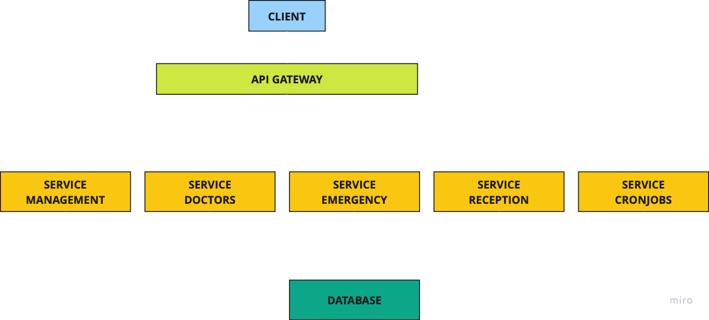

# SW Architectures Project Documentation

## Team Members

| Student Name      | Email                 | Matricola |
|-------------------|-----------------------|-----------|
| Stefano Zogno     | 1001900@stud.unive.it | 1001900   |
| Alessandro Dussin | 881424@stud.unive.it  | 881424    |
| Lukas Hrmo        | 1001537@stud.unive.it | 1001537   |
| Fedor Kazin       | 908385@stud.unive.it  | 908385    |
| Lorenzo Facchin   | 903942@stud.unive.it  | 903942    |

---

## Architectures



The software is a modern web application, developed with most popular and modern frameworks. The architecture used for this project is a service one, divided in the following components:

1. **Client**:  
   The user interface of the application, developed with **Angular 17**.

2. **API Gateway**:  
   it acts as a mediator between the client and the services. All client requests are sent to it, which redirects them correct service based on the URL and then it gets response of the service and return to the client. In addition, the API Gateway for each request which requires an authenticated user, verify if the given JWT Token is still valid, interacting with management service. Thanks to the API Gateway, we reduce the coupling in the architectures, since we have just one entrance point.

3. **Services**:
  - **Management**: it is used for everything concerns the session and user management. It provided API for create, edit, enable/disable user, login, logout and password changing
    - Languages and frameworks: **PHP 8.3**, **Symfony 6.4**, **Doctrine ORM 3.2**
  - **Doctor**: it is used for everything concerns patients, doctor and nurse side. In particular, it provides API for managing medical procedures (create, edit, delete and list), patient vitals (create, edit, delete and list) and assigning patient to a doctor.
    - Languages and frameworks: **Java 17**, **Spring Boot 3.4.0**
  - **Emergency**: it is used for managing the emergency, in particular it provides API for managing hospital beds, emergency visits, patient vitals and invoices.
    - Languages and frameworks: **Java 17**, **Spring Boot 3.4.0**
  - **Reception**: it is used by secretaries and provides API for getting information about patients.
    - Languages and frameworks: **C# .NET 8.0**, **ASP.NET Framework**, **EntityCore ORM**
  - **Cronjob**: this service is a set of scripts for report generation and database backup.
    - Languages and frameworks: **Python 3.12**

4. **Database**:  
   A shared **Postgres 16** database stores application data and is accessed by all services.

---

## How to Run the Application

Follow these steps to run the application:

### 1. Database

- Add a `.env` file in the root directory of the repository with the following content:
  ```env
  POSTGRES_USER=root
  POSTGRES_PASSWORD=root
  ```
- Run:
  ```bash
  docker-compose up --build -d
  ```
- Wait until the process finishes; it also creates `net_storage`.

### 2. API Gateway

- **For Windows Users**: Remove this line from the `docker-compose.yml`:
  ```yaml
  gateway -> platform -> linux/x86_64
  ```
- Run:
  ```bash
  docker-compose up --build -d
  ```

### 3. Management

- Run:
  ```bash
  docker-compose up --build -d
  ```
- Once completed, execute:
  ```bash
  docker exec --workdir /var/www/html service-management composer install --no-interaction --optimize-autoloader
  ```

### 4. Emergency

- **For Windows Users**: Remove this line from the `docker-compose.yml`:
  ```yaml
  service-emergency -> platform -> linux/x86_64
  ```
- Run:
  ```bash
  docker-compose up --build -d
  ```

### 5. Doctor

- **For Windows Users**: Remove this line from the `docker-compose.yml`:
  ```yaml
  service-doctor -> platform -> linux/x86_64
  ```
- Run:
  ```bash
  docker-compose up --build -d
  ```

### 6. Reception

- Run:
  ```bash
  docker-compose up --build -d
  ```

### 7. Cronjobs

- Run:
  ```bash
  docker-compose up --build -d
  ```

### 8. Client

- **Work in Progress**

---

Once all services are running, you can access the application at:
[http://localhost:4200](http://localhost:4200)

---

## Credentials

The database is seeded with default users for each role. Use the credentials below to log in:

- **Admin**:
  - Username: `admin`
  - Password: `P4ssword1@`

- **Doctor**:
  - Username: `doctor1` (Replace `1` with `2`, `3`, `4`, etc., for other doctors)
  - Password: `P4ssword1@`

- **Nurse**:
  - Username: `nurse1` (Replace `1` with `2`, `3`, `4`, etc., for other nurses)
  - Password: `P4ssword1@`

- **Secretary**:
  - Username: `secretary1` (Replace `1` with `2`, `3`, `4`, etc., for other secretaries)
  - Password: `P4ssword1@`

- **Patient**:
  - Username: `patient1` (Replace `1` with `2`, `3`, `4`, etc., for other patients)
  - Password: `P4ssword1@`

**Note**: New users are created with the default password `P4ssword1@`. They are required to change their password upon
first login.

---

## STEPS TO TRY APPLICATION

- **ADMIN**: 
   - Login with an admin user.
   - Click the various buttons to show the list of users, filtered by type.
   - Try to create/edit users of each type.
   - When you create a user, try to login with it and default password; the app should ask you to change the password.
- **PATIENT**:
   - Login with a patient user (ie: patient1)
   - TODO
- **DOCTOR**:
  - Login with a doctor user (ie: doctor1)
  - TODO
- **NURSE**:
  - Login with a nurse user (ie: nurse1)
  - TODO
- **SECRETARY**:
  - Login with a nurse secretary (ie: secretary1)
  - Try to create a new patient user;
  - Show the detail of a patient and try to edit it;
  - Change the password of a patient;
  - Try to edit the triage form of some patients.
  - Click on Billing invoice in the top menu and try to add a new or edit an existent one.
